# SAP AI Provider Architecture

This document provides a detailed overview of the SAP AI Provider's
architecture, internal components, and integration patterns.

**For general usage**, see [README](./README.md). **For API documentation**,
see [API Reference](./API_REFERENCE.md).

## TL;DR (Executive Summary)

**3-layer architecture** bridging your application to SAP AI services:

- **Application** → **Provider** → **SAP AI Core** → AI Models
- Implements Vercel AI SDK's V3 core with V2 and V4 compatibility facades
- Uses SAP AI SDK (`@sap-ai-sdk/orchestration` and `@sap-ai-sdk/foundation-models`) for API communication
- Transforms messages bidirectionally (AI SDK ↔ SAP format)
- Supports streaming, tool calling, multi-modal, data masking, and embeddings

**Key Components:** Provider → SAP SDK Client Configuration → Message Transformer → Error
Handler → SAP AI Core API

## Table of Contents

- [TL;DR (Executive Summary)](#tldr-executive-summary)
- [Overview](#overview)
  - [High-Level Architecture](#high-level-architecture)
  - [Component Interaction Flow](#component-interaction-flow)
  - [Key Design Principles](#key-design-principles)
- [Component Architecture](#component-architecture)
  - [Component Interaction Map](#component-interaction-map)
  - [Detailed Component Flow](#detailed-component-flow)
  - [Component Responsibilities](#component-responsibilities)
    - [`SAPAIProvider`](#sapaiprovider)
    - [`SAPAILanguageModel`](#sapailanguagemodel)
    - [`SAPAIEmbeddingModel`](#sapaiembeddingmodel)
    - [`SAP SDK Client Configuration`](#sap-sdk-client-configuration)
    - [`Message Conversion`](#message-conversion)
- [Request/Response Flow](#requestresponse-flow)
  - [Standard Text Generation (Complete Flow)](#standard-text-generation-complete-flow)
  - [Streaming Text Generation (SSE Flow)](#streaming-text-generation-sse-flow)
  - [Orchestration v2 Endpoint](#orchestration-v2-endpoint)
  - [Request Structure (v2)](#request-structure-v2)
  - [Response Structure (v2)](#response-structure-v2)
  - [Templating and Tools (v2)](#templating-and-tools-v2)
  - [Data Masking Module (v2)](#data-masking-module-v2)
  - [Request Cancellation](#request-cancellation)
  - [Tool Calling Flow](#tool-calling-flow)
  - [Data Masking Flow (SAP DPI Integration)](#data-masking-flow-sap-dpi-integration)
- [SAP SDK Authentication](#sap-sdk-authentication)
  - [Credential Sources](#credential-sources)
  - [Provider Responsibilities](#provider-responsibilities)
- [Error Handling](#error-handling)
  - [Error Conversion Architecture](#error-conversion-architecture)
  - [Error Classification](#error-classification)
  - [Retry Mechanism](#retry-mechanism)
  - [User-Facing Error Handling (v3.0.0+)](#user-facing-error-handling-v300)
- [Type System](#type-system)
  - [Model Configuration Types](#model-configuration-types)
  - [Request/Response Schemas](#requestresponse-schemas)
- [Integration Patterns](#integration-patterns)
  - [Provider Pattern](#provider-pattern)
  - [Adapter Pattern](#adapter-pattern)
  - [Strategy Pattern (Dual API Support)](#strategy-pattern-dual-api-support)
- [Performance Considerations](#performance-considerations)
  - [Request Optimization](#request-optimization)
  - [Memory Management](#memory-management)
  - [Monitoring and Observability](#monitoring-and-observability)
  - [Scalability Patterns](#scalability-patterns)
- [Versioned Package Architecture (V4 + V3 + V2)](#versioned-package-architecture-v4--v3--v2)
  - [V4 Facade Layer](#v4-facade-layer)
  - [V4 Source Files](#v4-source-files)
  - [V2 Facade Layer](#v2-facade-layer)
  - [V2 Source Files](#v2-source-files)
  - [Type Adapters](#type-adapters)
  - [Build Process](#build-process)
  - [Key Design Decisions](#key-design-decisions)
- [See Also](#see-also)

## Overview

The SAP AI Provider is designed as a bridge between the Vercel AI SDK and
SAP AI Core services. Its shared core implements `ProviderV3`; thin V2 and V4
facades expose the contracts required by AI SDK 5, 6, and 7 while preserving
the same SAP authentication, validation, and request strategies.

### High-Level Architecture

The diagram below illustrates the language-generation path of the SAP AI Provider,
showing how it integrates your application with SAP AI Core through the Vercel
AI SDK. The provider layer configures SAP AI SDK clients, transforms messages
between AI SDK and SAP formats, and converts errors. The SAP AI SDK and SAP
Cloud SDK handle credential discovery, token acquisition, token caching, and
token refresh. SAP AI Core routes requests to various AI models (OpenAI,
Anthropic Claude, Google Gemini, Amazon Nova, and open-source models).

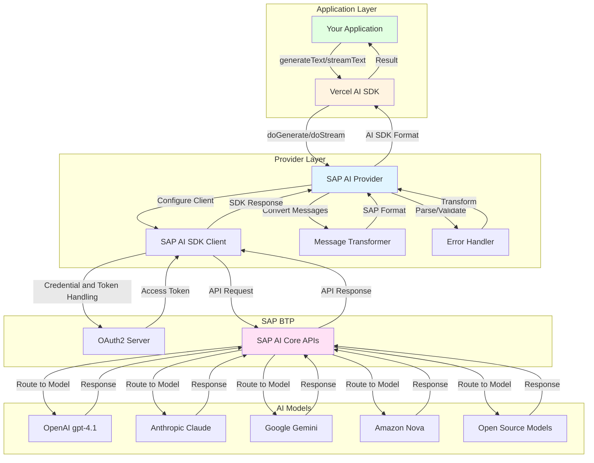

### Component Interaction Flow

This sequence diagram shows the Orchestration generation lifecycle from your application
through the AI SDK and provider to SAP AI Core. The flow is divided into four
phases: Message Transformation (converting AI SDK format to SAP format),
SAP SDK client setup, API Request & Response (including SDK authentication and
communication with SAP AI Core and the AI model), and Response Processing
(converting back to AI SDK format).

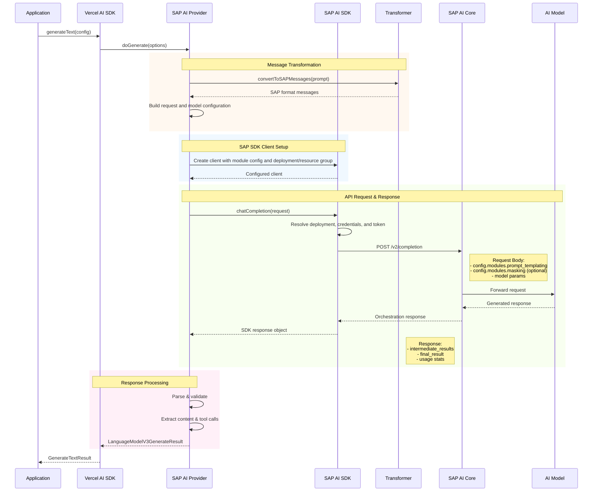

### Key Design Principles

1. **Compatibility**: Full compatibility with Vercel AI SDK interfaces
2. **Type Safety**: Comprehensive TypeScript types for all operations
3. **Error Resilience**: Retryable error classification for high-level AI SDK retries
4. **Performance**: Efficient request handling and response streaming
5. **Security**: Secure authentication and credential management

## Component Architecture

### Component Interaction Map

This diagram details the responsibilities of each major component in the
provider architecture, including the SAPAIProvider (factory and shared
configuration), SAPAILanguageModel (request/response handling, tool calls), SAP
SDK Client Configuration (deployment, resource group, and destination setup),
Message Transformer (format conversion), API Client (HTTP communication), and
Error Handling system.

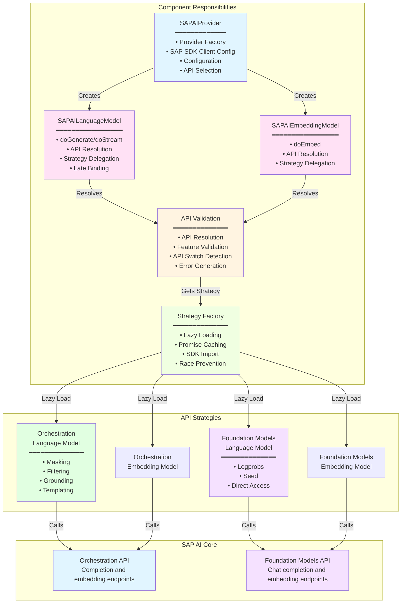

### Detailed Component Flow

```text
src/
│   # V3 Implementation (AI SDK 6; LanguageModelV3/EmbeddingModelV3)
├── index.ts                                        # V3 public API exports (AI SDK 6)
├── sap-ai-provider.ts                              # V3 provider factory
├── sap-ai-language-model.ts                        # V3 language model (API-agnostic)
├── sap-ai-embedding-model.ts                       # V3 embedding model (API-agnostic)
│
│   # V4 Facade Layer (AI SDK 7; LanguageModelV4/EmbeddingModelV4)
├── index-v4.ts                                     # V4 public API exports (AI SDK 7 facade)
├── sap-ai-provider-v4.ts                           # V4 provider factory (wraps V3)
├── sap-ai-language-model-v4.ts                     # V4 language model facade
├── sap-ai-embedding-model-v4.ts                    # V4 embedding model facade
├── sap-ai-adapters-v4-to-v3.ts                     # V4 prompt normalization
├── sap-ai-adapters-v3-to-v4.ts                     # V4 result conversion
│
│   # V2 Facade Layer (AI SDK 5; AI SDK 6 compatibility)
├── index-v2.ts                                     # V2 public API exports (AI SDK 5 facade)
├── sap-ai-provider-v2.ts                           # V2 provider factory (wraps V3)
├── sap-ai-language-model-v2.ts                     # V2 language model (wraps V3)
├── sap-ai-embedding-model-v2.ts                    # V2 embedding model (wraps V3)
├── sap-ai-adapters-v3-to-v2.ts                     # V3→V2 format conversion
│
│   # Shared Infrastructure
├── sap-ai-provider-options.ts                      # Provider options & Zod schemas
├── sap-ai-settings.ts                              # Settings and type definitions
├── sap-ai-error.ts                                 # Error handling system
├── sap-ai-validation.ts                            # API resolution & validation
├── sap-ai-strategy.ts                              # Strategy factory (lazy loading)
├── strategy-utils.ts                               # Shared strategy utilities
├── base-language-model-strategy.ts                 # Base class for language model strategies (Template Method)
├── base-embedding-model-strategy.ts                # Base class for embedding model strategies (Template Method)
├── orchestration-language-model-strategy.ts       # Orchestration API strategy
├── orchestration-embedding-model-strategy.ts      # Orchestration embedding strategy
├── foundation-models-language-model-strategy.ts   # Foundation Models API strategy
├── foundation-models-embedding-model-strategy.ts  # Foundation Models embedding strategy
├── convert-to-sap-messages.ts                     # Message format conversion
├── deep-merge.ts                                   # Deep merge utility
└── version.ts                                      # Package version constant
```

### Component Responsibilities

#### `SAPAIProvider`

- **Purpose**: Factory for creating language and embedding model instances
- **Responsibilities**:
  - SAP AI SDK client configuration
  - Configuration validation
  - Model instance creation (language and embedding)
  - Base URL and deployment management

#### `SAPAILanguageModel`

- **Purpose**: Implementation of Vercel AI SDK's `LanguageModelV3`
- **Responsibilities**:
  - Request/response transformation
  - Streaming support
  - Tool calling implementation
  - Multi-modal input handling

#### `SAPAIEmbeddingModel`

- **Purpose**: Implementation of Vercel AI SDK's `EmbeddingModelV3`
- **Responsibilities**:
  - Embedding generation via `doEmbed()`
  - Batch size validation (`maxEmbeddingsPerCall`)
  - AbortSignal handling for request cancellation
  - Uses `OrchestrationEmbeddingClient` from SAP AI SDK

#### `SAP SDK Client Configuration`

- **Purpose**: Configure SAP AI SDK clients for SAP AI Core calls
- **Responsibilities**:
  - Pass deployment ID or resource group to SAP AI SDK clients
  - Pass custom SAP Cloud SDK destination options when configured
  - Set SAP Cloud SDK log level defaults
  - Leave credential discovery, token acquisition, token caching, and token refresh to the SAP AI SDK and SAP Cloud SDK

#### `Message Conversion`

- **Purpose**: Format translation between AI SDK and SAP AI Core
- **Responsibilities**:
  - Prompt format conversion
  - Multi-modal content handling
  - Tool call format transformation

## Request/Response Flow

### Standard Text Generation (Complete Flow)

This detailed sequence diagram shows the complete flow for a standard text
generation request, including all steps from application call through
authentication, message transformation, SAP AI Core API communication, and
response processing back to the application.

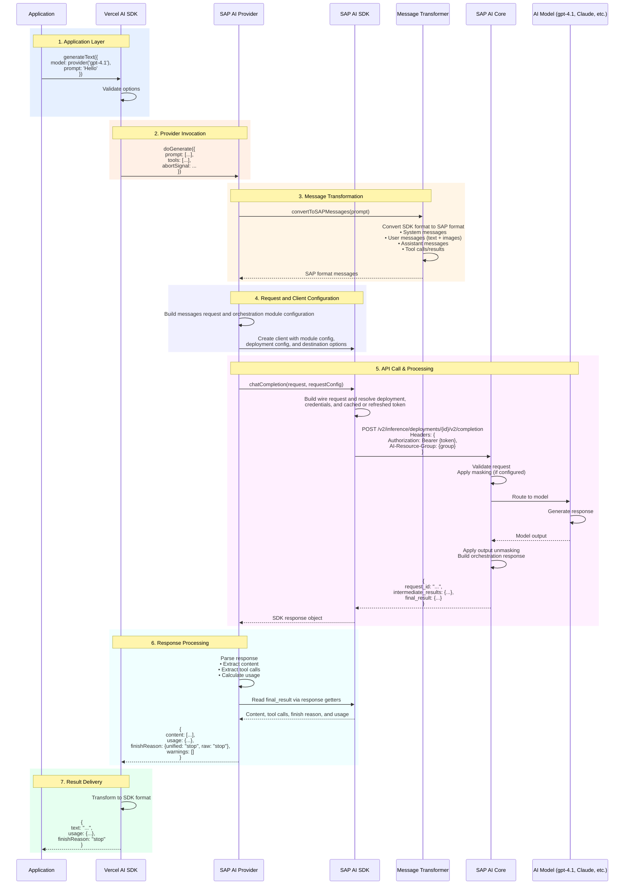

### Streaming Text Generation (SSE Flow)

This diagram illustrates the streaming text generation flow using Server-Sent
Events (SSE). Unlike standard generation, streaming returns partial responses
incrementally as the AI model generates content, enabling real-time display of
results to users.

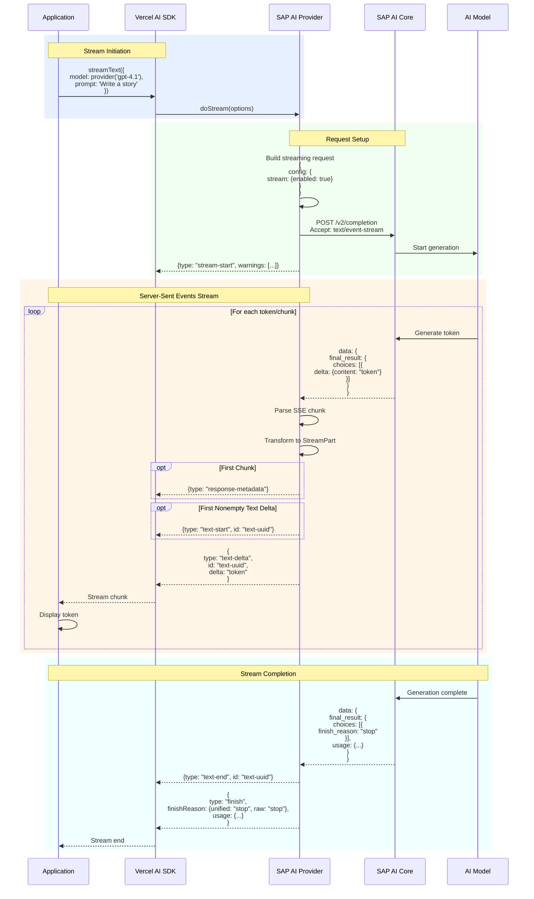

### Orchestration v2 Endpoint

SAP AI Core Orchestration v2 introduces a more structured API with improved
capabilities:

**Default Path:**

```text
${baseURL}/inference/deployments/{deploymentId}/v2/completion
```

**Top-level v2 endpoint:**

```http
POST /v2/completion
```

([documentation](https://api.sap.com/api/ORCHESTRATION_API_v2/resource/Orchestrated_Completion))

**Configuration:**

```typescript
// Default configuration
const provider = createSAPAIProvider({
  resourceGroup: "default",
});

// With specific deployment
const provider = createSAPAIProvider({
  deploymentId: "d65d81e7c077e583",
  resourceGroup: "production",
});
```

### Request Structure (v2)

The v2 API uses a modular configuration structure:

```typescript
{
  config: {
    modules: {
      prompt_templating: {
        prompt: {
          template: [ /* messages */ ],
          defaults: { /* placeholder defaults */ },
          response_format: { /* text | json_object | json_schema */ },
          tools: [ /* function definitions */ ]
        },
        model: {
          name: "gpt-4.1",
          version: "latest",
          params: {
            temperature: 0.7,
            max_tokens: 2000,
            // ... other params
          }
        }
      },
      masking: { /* optional DPI configuration */ }
    },
    stream: { /* optional streaming config */ }
  },
  placeholder_values: { /* optional values for template placeholders */ },
  messages_history: [ /* optional conversation history */ ]
}
```

### Response Structure (v2)

```typescript
{
  request_id: "uuid",
  intermediate_results: {
    templating: [ /* resolved messages */ ],
    llm: {
      id: "chatcmpl-xxx",
      object: "chat.completion",
      created: 1234567890,
      model: "gpt-4.1-2024-08-06",
      choices: [{
        index: 0,
        message: {
          role: "assistant",
          content: "response text",
          tool_calls: [ /* if any */ ]
        },
        finish_reason: "stop"
      }],
      usage: {
        prompt_tokens: 100,
        completion_tokens: 50,
        total_tokens: 150
      }
    },
    output_unmasking: [ /* if masking enabled */ ]
  },
  final_result: { /* same structure as llm result */ }
}
```

### Templating and Tools (v2)

**Prompt Templating:**

- Messages are passed under `config.modules.prompt_templating.prompt.template`
- Supports system, user, assistant, tool, and developer roles
- Multi-modal content (text + images) supported

**Response Format:**

```typescript
// Text (default when no tools)
response_format: { type: "text" }

// JSON object
response_format: { type: "json_object" }

// JSON schema (structured output)
response_format: {
  type: "json_schema",
  json_schema: {
    name: "user_profile",
    description: "User profile schema",
    schema: {
      type: "object",
      properties: { /* JSON schema */ },
      required: [ /* required fields */ ]
    },
    strict: true
  }
}
```

**Tool Definitions:**

```typescript
tools: [
  {
    type: "function",
    function: {
      name: "calculator",
      description: "Perform arithmetic operations",
      parameters: {
        type: "object",
        properties: {
          operation: { type: "string", enum: ["add", "subtract"] },
          a: { type: "number" },
          b: { type: "number" },
        },
        required: ["operation", "a", "b"],
      },
    },
  },
];
```

### Data Masking Module (v2)

The masking module integrates with SAP Data Privacy Integration (DPI):

```typescript
modules: {
  prompt_templating: { /* ... */ },
  masking: {
    masking_providers: [{
      type: "sap_data_privacy_integration",
      method: "anonymization",  // or "pseudonymization"
      entities: [
        {
          type: "profile-email",
          replacement_strategy: { method: "fabricated_data" }
        },
        {
          type: "profile-person",
          replacement_strategy: { method: "constant", value: "REDACTED" }
        },
        {
          regex: "\\b[0-9]{4}-[0-9]{4}\\b",
          replacement_strategy: { method: "constant", value: "ID_REDACTED" }
        }
      ],
      allowlist: ["SAP", "BTP"],
      mask_grounding_input: { enabled: false }
    }]
  }
}
```

**Masking Flow:**

1. Input passes through masking module
2. Sensitive data is anonymized/pseudonymized
3. Masked data sent to LLM
4. Response passes through output_unmasking (if configured)
5. Original values restored in final output

### Request Cancellation

The provider supports HTTP-level request cancellation via `AbortSignal`. The
per-call `abortSignal` is merged with the provider-level `requestConfig` (see
[`SAPAIProviderSettings.requestConfig`](./API_REFERENCE.md#sapaiprovidersettings))
via the internal `mergeRequestConfig` helper. Any `signal` present on
`requestConfig` is dropped so the AI SDK `abortSignal` always wins.

The snippets below show the **Orchestration** call sites. The **Foundation Models**
path uses `client.run()` for non-streaming and a 3-argument
`client.stream(request, abortSignal, requestConfig)` for streaming; the same
`mergeRequestConfig` helper is applied in both cases.

**Non-streaming (Orchestration):**

```typescript
const response = await client.chatCompletion(request, mergeRequestConfig(requestConfig, abortSignal));
```

**Streaming (Orchestration):**

```typescript
const stream = await client.stream(request, abortSignal, streamOptions, mergeRequestConfig(requestConfig, undefined));
```

The signal is forwarded to the SAP AI SDK, which passes it to the underlying
Axios HTTP client to cancel the request. This does not guarantee that SAP AI Core
or the deployed model stops server-side processing.

### Tool Calling Flow

This diagram shows how tool calling (function calling) works. When the AI model
needs to call a tool, it returns structured tool call requests. Your application
executes the tools and provides results back, which the model uses to generate
the final response.

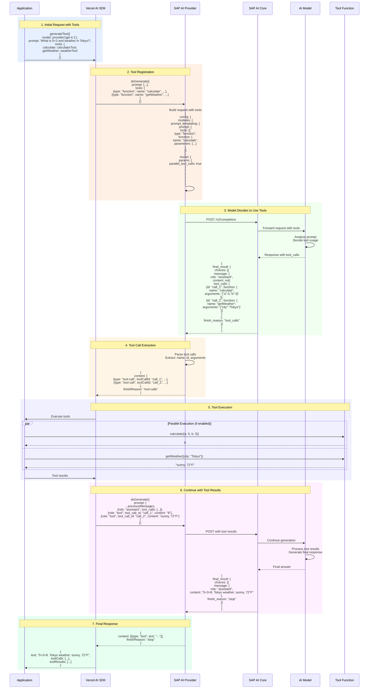

### Data Masking Flow (SAP DPI Integration)

This diagram illustrates how SAP Data Privacy Integration (DPI) works. When
enabled, sensitive data in prompts is automatically masked before being sent to
AI models, and the masked entities are tracked and unmasked in responses.

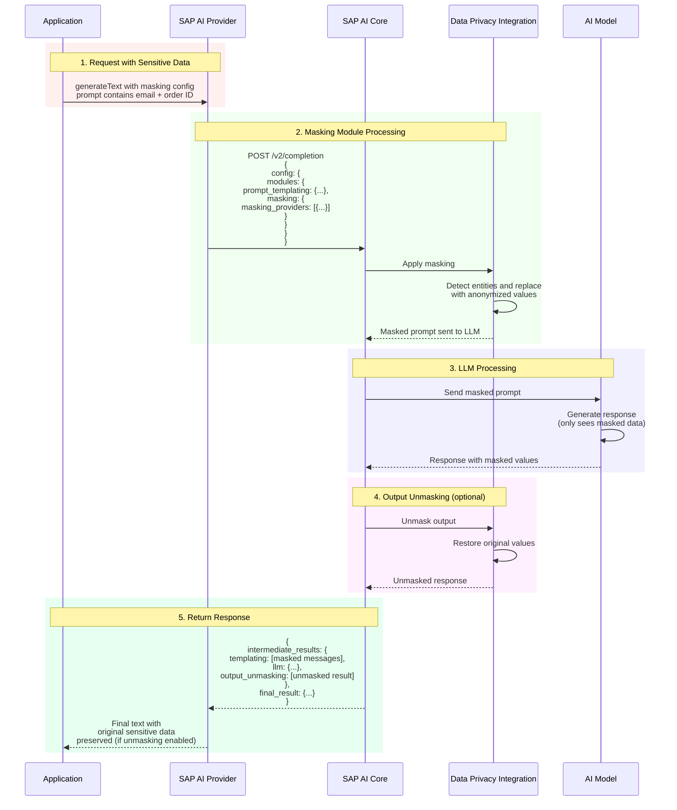

## SAP SDK Authentication

Authentication is handled by the SAP AI SDK packages and the SAP Cloud SDK. This
provider doesn't implement an OAuth manager or token cache. It creates SAP SDK
clients with the selected deployment configuration, resource group, and optional
destination settings, then the SDK layers resolve credentials and manage tokens.

### Credential Sources

The SAP SDK layers read credentials from the standard SAP Cloud SDK sources:

- **Local**: `AICORE_SERVICE_KEY` environment variable
- **SAP BTP**: `VCAP_SERVICES` service binding
- **Custom destination**: `destination` passed to `createSAPAIProvider()`

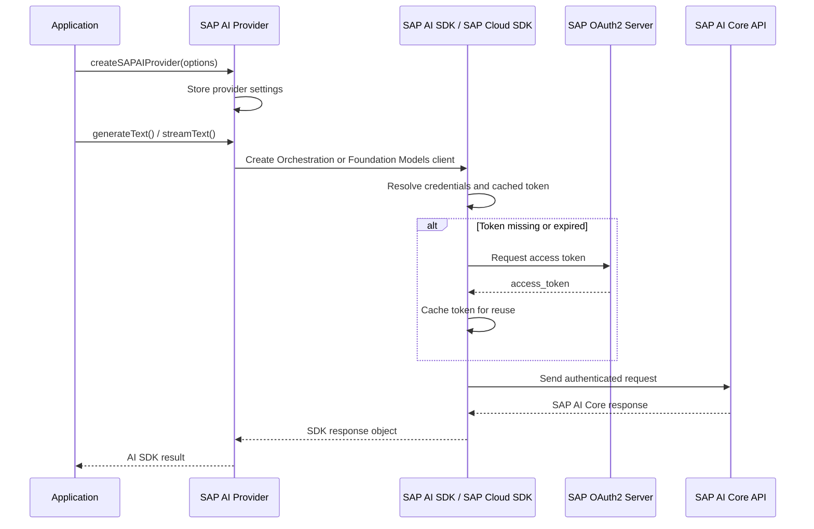

### Provider Responsibilities

This provider is responsible for:

- Selecting Orchestration or Foundation Models API
- Passing `deploymentId`, `resourceGroup`, and `destination` to SAP SDK clients
- Applying model settings and per-call provider options
- Converting messages and responses between AI SDK and SAP formats
- Converting SAP SDK errors to Vercel AI SDK error types

The SAP AI SDK and SAP Cloud SDK are responsible for credential discovery, token
acquisition, token caching, token refresh, and authenticated HTTP calls.

## Error Handling

The provider implements robust error handling by converting SAP AI SDK errors to
standard Vercel AI SDK error types for consistent error handling across
providers.

### Error Conversion Architecture

```typescript
// Internal error handling in doGenerate/doStream
try {
  const response = await client.chatCompletion({ messages });
  // Process response...
} catch (error) {
  // Convert to AI SDK standard errors
  throw convertToAISDKError(error, {
    operation: "doGenerate",
    url: "sap-ai:orchestration",
    requestBody: requestSummary,
  });
}
```

### Error Classification

The `convertToAISDKError()` function handles error conversion with a clear
priority:

1. **Existing `APICallError`, `LoadAPIKeyError`, or `NoSuchModelError`?** → Return as-is
2. **Structured SAP error?** → Convert 401/403 to `LoadAPIKeyError`, 404 to
   `NoSuchModelError`, and other statuses to `APICallError`
3. **Aborted request?** → Non-retryable `APICallError` with status 499
4. **Recognized error message?** → Classify authentication/deployment failures,
   extract a status from `status code NNN`, or apply a category-specific mapping
5. **Unknown error?** → Non-retryable `APICallError` with status 500

Converted `APICallError` instances carry the supplied URL and request summary,
plus response headers/body when available. Authentication and model errors do
not expose those HTTP-context fields; structured SAP request IDs are included
in their messages.

### Retry Mechanism

For structured SAP errors and statuses extracted from error messages, the
provider classifies HTTP statuses as follows:

- **408 (Request Timeout)**: `isRetryable: true` → Retry after timeout
- **409 (Conflict)**: `isRetryable: true` → Retry on transient conflicts
- **429 (Rate Limit)**: `isRetryable: true` → Exponential backoff
- **5xx (Server Errors)**: `isRetryable: true` → Exponential backoff
- **400 (Bad Request)**: `isRetryable: false` → Client must fix request
- **401/403 (Auth Errors)**: Non-retryable → Fix credentials
- **404 (Not Found)**: Non-retryable → Fix model/deployment

Message-based categories can override status-based retryability: for example,
unknown errors and stream-consumption errors use status 500 but are not
retryable. `LoadAPIKeyError` and `NoSuchModelError` have no `isRetryable` field.

High-level Vercel AI SDK calls handle retries based on `isRetryable` and
`maxRetries`. Direct provider calls do not add a retry loop, and failures after
streaming has begun require application handling.

### User-Facing Error Handling (v3.0.0+)

For structured SAP error responses, this provider uses standard Vercel AI SDK
error types:

- **401/403 (Authentication)** → `LoadAPIKeyError`
- **404 (Model/Deployment not found)** → `NoSuchModelError`
- **Other HTTP errors** → `APICallError` with SAP metadata in `responseBody`

Generic SDK/Axios errors follow the message-based classification above. For
example, `Request failed with status code 404` without a structured SAP body
becomes `APICallError`, not `NoSuchModelError`. Handle both forms.

**Breaking change in v3.0.0:** The custom `SAPAIError` class was removed to
ensure full compatibility with the AI SDK ecosystem and enable automatic retry
mechanisms.

**For implementation details and code examples:**

- [API Reference - Error Handling Examples](./API_REFERENCE.md#error-handling-examples) -
  Complete examples with all error types
- [Troubleshooting Guide](./TROUBLESHOOTING.md#parsing-sap-error-metadata-v300) -
  Quick reference and common issues

**For v2→v3 migration**, see
[Migration Guide - v2 to v3](./MIGRATION_GUIDE.md#version-2x-to-3x-breaking-changes).

## Type System

### Model Configuration Types

Key types for model configuration:

- **`SAPAIModelId`**: String union of supported models (e.g., "gpt-4.1",
  "anthropic--claude-4.5-sonnet", "gemini-2.5-pro") with flexibility for custom models
- **`SAPAISettings`**: Interface with `modelVersion`, `modelParams` (maxTokens,
  temperature, topP, etc.), `responseFormat`, `includeReasoning`, and
  API-specific masking, filtering, grounding, and translation options

See `src/sap-ai-settings.ts` for complete type definitions.

### Request/Response Schemas

All API interactions use types from `@sap-ai-sdk/orchestration` and
`@sap-ai-sdk/foundation-models`, validated for type safety. Key types include:

- `ChatCompletionRequest`: Orchestration config and input parameters
- `OrchestrationResponse`: API responses with module results
- `ChatMessage`: Message format (role, content, tool calls)
- `ChatCompletionTool`: Function definitions and parameters

See `src/sap-ai-settings.ts` for the main settings interface and re-exported SAP
AI SDK types.

## Integration Patterns

### Provider Pattern

The provider implements the factory pattern for model creation:

```typescript
interface SAPAIProvider extends ProviderV3 {
  // Function call syntax
  (modelId: SAPAIModelId, settings?: SAPAISettings): SAPAILanguageModel;

  // Method call syntax
  chat(modelId: SAPAIModelId, settings?: SAPAISettings): SAPAILanguageModel;
}
```

### Adapter Pattern

The message conversion system adapts between Vercel AI SDK format and SAP AI
Core format. The `convertToSAPMessages()` function transforms prompt arrays,
handling text content, images, files, tool calls, and tool results across different
message formats.

### Strategy Pattern (Dual API Support)

The provider uses the Strategy Pattern with lazy loading to support two SAP AI
Core APIs: **Orchestration API** and **Foundation Models API**. This enables
feature-rich orchestration capabilities or direct model access depending on
your needs.

#### Architecture Overview

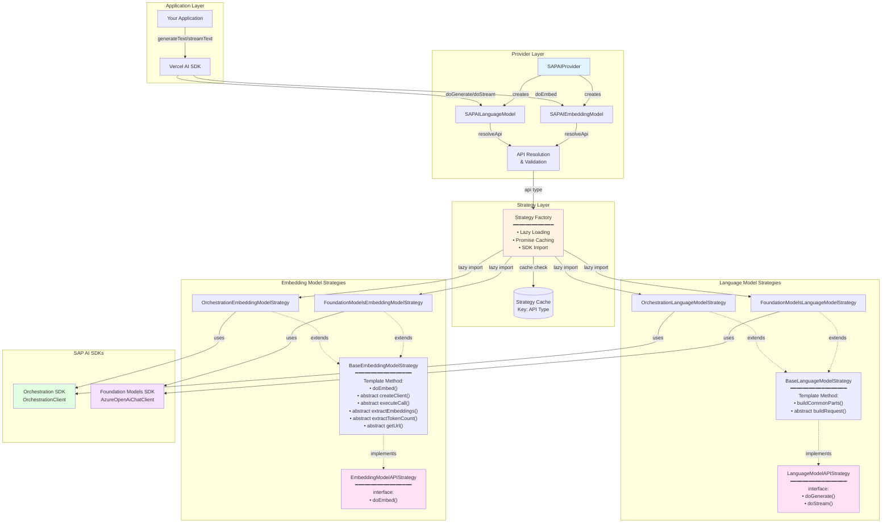

#### Late Binding Flow

Strategies are loaded lazily at first invocation - not at provider creation
time. This enables:

1. **Deferred client loading** - API client packages are dynamically imported
   when a strategy is first needed; public helper re-exports may load other SDK code earlier
2. **Shared strategy instances** - Cache one loading promise per API and model kind
3. **Runtime flexibility** - Select APIs at provider, model, or call level,
   subject to API-specific feature validation

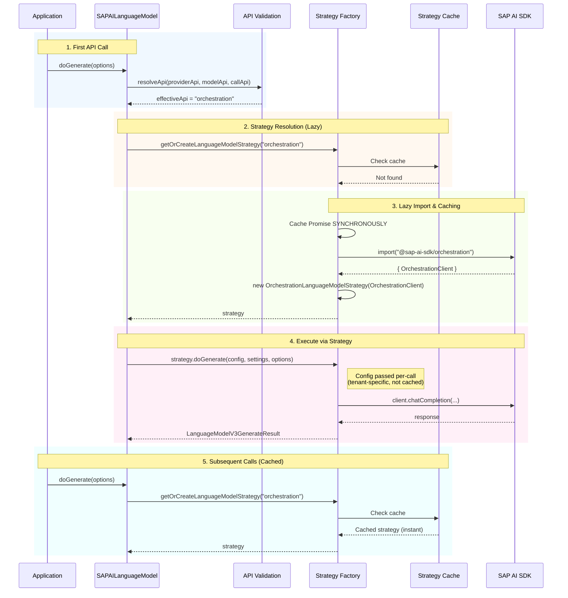

#### Strategy Interface Design

Strategies implement stateless interfaces - all tenant-specific configuration
flows through method parameters, never cached in strategy instances:

```typescript
// Language model strategy interface
interface LanguageModelAPIStrategy {
  doGenerate(
    config: LanguageModelStrategyConfig, // Tenant config - passed per-call
    settings: SAPAIModelSettings, // Merged model settings
    options: LanguageModelV3CallOptions, // AI SDK options
  ): Promise<LanguageModelV3GenerateResult>;

  doStream(config: LanguageModelStrategyConfig, settings: SAPAIModelSettings, options: LanguageModelV3CallOptions): Promise<LanguageModelV3StreamResult>;
}

// Embedding model strategy interface
interface EmbeddingModelAPIStrategy {
  doEmbed(config: EmbeddingModelStrategyConfig, settings: SAPAIEmbeddingSettings, options: EmbeddingModelV3CallOptions, maxEmbeddingsPerCall: number): Promise<EmbeddingModelV3Result>;
}
```

#### Template Method Pattern (Base Embedding Model Strategy)

The `BaseEmbeddingModelStrategy` abstract class uses the Template Method pattern
to consolidate shared logic for embedding generation while allowing API-specific
customization:

```typescript
// Base class with Template Method pattern for embeddings
abstract class BaseEmbeddingModelStrategy<TClient, TResponse> implements EmbeddingModelAPIStrategy {
  // Template method - defines the embedding algorithm skeleton
  async doEmbed(config, settings, options, maxEmbeddingsPerCall): Promise<EmbeddingModelV3Result> {
    const { abortSignal, values } = options;

    try {
      const { embeddingOptions, providerName } = await prepareEmbeddingCall({ maxEmbeddingsPerCall, modelId: config.modelId, provider: config.provider }, options);
      const embeddingType = embeddingOptions?.type ?? settings.type ?? "text";
      const warnings: SharedV3Warning[] = [];
      this.resolveWarnings(settings, warnings);
      const client = this.createClient(config, settings, embeddingOptions);
      const response = await this.executeCall(client, values, embeddingType, abortSignal, config.requestConfig);
      const embeddings = this.extractEmbeddings(response);
      const totalTokens = this.extractTokenCount(response);
      const { headers: responseHeaders, requestId } = this.extractResponseMetadata(response);

      return buildEmbeddingResult({
        embeddings,
        modelId: config.modelId,
        providerName,
        requestId,
        responseHeaders,
        totalTokens,
        version: VERSION,
        warnings,
      });
    } catch (error) {
      if (error instanceof TooManyEmbeddingValuesForCallError) throw error;
      throw convertToAISDKError(error, {
        operation: "doEmbed",
        requestBody: { values: values.length },
        url: this.getUrl(),
      });
    }
  }

  // Primitive operations (hooks) - implemented by subclasses
  protected abstract createClient(config: EmbeddingModelStrategyConfig, settings: SAPAIEmbeddingSettings, embeddingOptions: EmbeddingProviderOptions | undefined): TClient;
  protected abstract executeCall(client: TClient, values: string[], embeddingType: EmbeddingType, abortSignal: AbortSignal | undefined, requestConfig: CustomRequestConfig | undefined): Promise<TResponse>;
  protected abstract extractEmbeddings(response: TResponse): EmbeddingModelV3Embedding[];
  protected abstract extractTokenCount(response: TResponse): number;
  protected abstract getUrl(): string;
}
```

The `doEmbed()` method orchestrates the embedding workflow, defining the sequence
of operations. Concrete embedding strategies like `OrchestrationEmbeddingModelStrategy`
and `FoundationModelsEmbeddingModelStrategy` extend this base class and implement
the abstract primitive operations (hooks) to provide API-specific
implementations for creating clients, executing calls, and extracting data.

**Key Hooks:**

1. `createClient(config, settings, embeddingOptions)`: Factory for the specific SDK client.
2. `executeCall(client, values, embeddingType, abortSignal, requestConfig)`: Executes the API call.
3. `extractEmbeddings(response)`: Extracts and normalizes embedding vectors.
4. `extractTokenCount(response)`: Retrieves token usage from the response.
5. `getUrl()`: Returns the API URL for error context.

The abbreviated class above omits the optional `resolveWarnings()` and
`extractResponseMetadata()` hook definitions. Subclasses use them to surface
warnings, request IDs, and response headers.

**Benefits:**

- **Code Reusability**: Eliminates approximately 50 lines of duplicate code
  per strategy by centralizing the core embedding algorithm.
- **Single Source of Truth**: Ensures consistent embedding logic across different
  API implementations.
- **Type Safety**: Utilizes generic type parameters (`<TClient, TResponse>`)
  for enhanced type checking and developer experience.
- **Extensibility**: Simplifies adding new embedding providers by requiring
  only the implementation of a few abstract methods.

#### Template Method Pattern (Base Language Model Strategy)

The `BaseLanguageModelStrategy` abstract class uses the Template Method pattern
to consolidate shared logic while allowing API-specific customization. The
following pseudocode abbreviates generic types, error conversion, and metadata
assembly; see the source for the complete implementation:

```typescript
// Base class with Template Method pattern
abstract class BaseLanguageModelStrategy implements LanguageModelAPIStrategy {
  // Template method - defines the algorithm skeleton
  async doGenerate(config, settings, options): Promise<LanguageModelV3GenerateResult> {
    const commonParts = await this.buildCommonParts(config, settings, options);
    const { request, warnings } = this.buildRequest(config, settings, options, commonParts);
    const client = this.createClient(config, settings, commonParts);
    const response = await this.executeApiCall(client, request, options.abortSignal, config.requestConfig);
    return buildGenerateResult({ modelId, providerName, request, response, warnings });
  }

  // Common logic shared by all strategies
  protected async buildCommonParts(config, settings, options): Promise<CommonParts> { /* ... */ }

  // Primitive operations - implemented by subclasses
  protected abstract buildRequest(...): { request: ApiRequest; warnings: Warning[] };
  protected abstract createClient(config, settings, commonParts): ApiClient;
  protected abstract executeApiCall(client, request, abortSignal, requestConfig): Promise<ApiResponse>;
}
```

The concrete strategies (`OrchestrationLanguageModelStrategy` and
`FoundationModelsLanguageModelStrategy`) extend this base class and implement
only the API-specific primitive operations.

#### API Selection Hierarchy

The effective API is resolved with a clear priority order:

```text
Call-time api > Model-time api > Provider-time api > Default ("orchestration")
```

```typescript
// Provider-level default
const provider = createSAPAIProvider({ api: "orchestration" });

// Model-level override
const model = provider("gpt-4.1", { api: "foundation-models" });

// Call-level override (highest priority)
const result = await generateText({
  model,
  prompt: "Hello",
  providerOptions: {
    "sap-ai": { api: "orchestration" }, // Wins!
  },
});
```

#### Feature Validation

The validation layer ensures features are compatible with the resolved API:

- **Orchestration-only features**: masking, filtering, grounding, templating, translation
- **Foundation Models-only feature**: `dataSources`
- **Common features**: temperature, maxTokens, topP, seed, stop sequences, tools, streaming

Incompatible feature combinations throw `UnsupportedFeatureError` with helpful
suggestions for which API to use instead. Additional `modelParams` such as
`logprobs` and `logit_bias` are passed through; their support is determined by
the SAP backend/model rather than these API-feature checks.

## Performance Considerations

### Request Optimization

1. **Connection Pooling**: Reuse HTTP connections
2. **Request Batching**: Group multiple requests when possible
3. **Caching**: Reuse stateless strategy instances and let SAP Cloud SDK handle
   token caching; SAP SDK clients are created per call
4. **Compression**: Enable gzip/deflate for requests/responses

### Memory Management

1. **Stream Processing**: Use streams for large responses
2. **Pull-Based TransformStream**: SDK `AsyncIterable` → `ReadableStream` →
   `TransformStream` pipeline matching the idiomatic Vercel AI SDK provider
   pattern, enabling natural backpressure propagation
3. **Garbage Collection**: Proper cleanup of resources
4. **Buffer Management**: Efficient handling of binary data

### Monitoring and Observability

Consider tracking:

- Request counts (total, successful, failed)
- Response times and token usage
- Error rates by status code
- SAP SDK authentication and service-binding errors

### Scalability Patterns

These are application-level recommendations, not built-in provider features:

1. **Horizontal Scaling**: Support for multiple instances
2. **Load Balancing**: Distribute requests across deployments
3. **Circuit Breaker**: Prevent cascade failures
4. **Rate Limiting**: Client-side rate limiting to prevent 429s (e.g., token
   bucket or sliding window algorithm)

This architecture ensures the SAP AI Provider is robust, scalable, and
maintainable while providing a seamless integration experience with the Vercel
AI SDK.

---

## Versioned Package Architecture (V4 + V3 + V2)

This repository publishes **two npm packages** from a single codebase. The main
package exposes three versioned entrypoints; the standalone V2 package preserves
the existing package name for consumers that cannot use subpath exports.

| Package export                      | Interface                              | Target users                     |
| ----------------------------------- | -------------------------------------- | -------------------------------- |
| `@jerome-benoit/sap-ai-provider`    | `LanguageModelV3` / `EmbeddingModelV3` | AI SDK 6                         |
| `@jerome-benoit/sap-ai-provider/v2` | `LanguageModelV2` / `EmbeddingModelV2` | AI SDK 5; AI SDK 6 compatibility |
| `@jerome-benoit/sap-ai-provider/v4` | `LanguageModelV4` / `EmbeddingModelV4` | AI SDK 7                         |
| `@jerome-benoit/sap-ai-provider-v2` | `LanguageModelV2` / `EmbeddingModelV2` | AI SDK 5; AI SDK 6 compatibility |

### V4 Facade Layer

The V4 facade normalizes AI SDK 7 prompts into the shared V3 core and converts
generated and streamed V3 results back to V4 shapes. V4-only content with no V3
equivalent is rejected explicitly rather than silently discarded.

### V4 Source Files

```text
src/
├── index-v4.ts                    # V4 public API exports (AI SDK 7 facade)
├── sap-ai-provider-v4.ts          # V4 provider factory
├── sap-ai-language-model-v4.ts    # V4 language model facade
├── sap-ai-embedding-model-v4.ts   # V4 embedding model facade
├── sap-ai-adapters-v4-to-v3.ts    # Prompt normalization
└── sap-ai-adapters-v3-to-v4.ts    # Result and stream conversion
```

### V2 Facade Layer

The V2 package uses a **facade pattern** that wraps the internal V3 implementation.
The official provider v2 result types are a development-only dependency: both builds
inline them and their JSON Schema types into the published declarations. Consumers
do not install the `@ai-sdk/provider-v2` alias. This preserves AI SDK 5 result
compatibility without copying upstream definitions into our source.

V2 language-model inputs use the current upstream contracts, accepting both
provider-tool discriminators shipped with AI SDK 5 and 6. Warning declarations
reflect the `other` warnings that the adapters actually return. These are type-only
compatibility measures, not an additional runtime implementation.

The JSON type divergence remains in provider 2.0.4 and 4.0.13; see
[upstream PR #8537](https://github.com/vercel/ai/pull/8537).

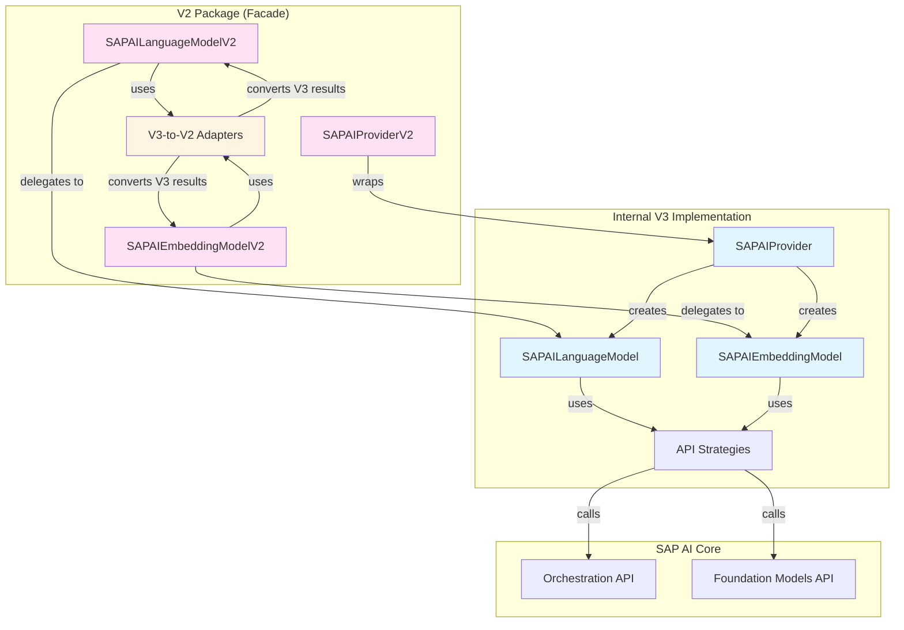

### V2 Source Files

```text
src/
├── index-v2.ts                    # V2 public API exports (AI SDK 5 facade)
├── sap-ai-provider-v2.ts          # V2 provider factory (facade)
├── sap-ai-language-model-v2.ts    # V2 language model (delegates to V3)
├── sap-ai-embedding-model-v2.ts   # V2 embedding model (delegates to V3)
└── sap-ai-adapters-v3-to-v2.ts    # Type adapters (V3 results → V2 format)
```

### Type Adapters

The adapter layer (`sap-ai-adapters-v3-to-v2.ts`) handles conversion between V3 and V2 interfaces:

- **Finish Reason**: `{ unified, raw? }` object → string (`"stop"`, `"tool-calls"`, etc.)
- **Usage**: Nested structure with `inputTokens.total` → flat `{ inputTokens, outputTokens, totalTokens }`
- **Stream Parts**: Preserves text/reasoning block lifecycle and deltas; converts
  finish/warning payloads and drops unsupported V3-only content
- **Warnings**: V3 `unsupported`/`compatibility` warnings → V2 `other` warnings
  with descriptive messages

### Build Process

The builds are **sequential** to the same `dist/` directory:

```bash
# Main package build: V3 root plus /v2 and /v4 entrypoints
npm run build              # tsup.config.ts → dist/
npm publish                # @jerome-benoit/sap-ai-provider

# V2 publication (run from a separate clean checkout)
AI_SDK_VERSION=v2 npm publish # prepublishOnly builds, checks, and prepares V2
```

**Why sequential?** Both builds use `clean: true` and replace `dist/`. The
standalone publication also rewrites `package.json` and `package-lock.json`, so
run it in a separate clean checkout. Do not run `prepare:v2` manually before
`npm publish`: the publication lifecycle performs preparation after building.

### Key Design Decisions

1. **Single source of truth**: All SAP AI Core logic lives in the V3 implementation
2. **Thin facades**: V2 and V4 translate interface contracts without duplicating business logic
3. **Versioned entrypoints**: One main package supports AI SDK 5–7 without mixing model contracts
4. **Standalone V2 publication**: Existing V2 consumers retain their dedicated package
5. **Adapter isolation**: Version conversions remain centralized and independently testable

---

## See Also

**For getting started and basic usage**, see the [README](./README.md).

**Related Technical Documentation:**

- [API Reference](./API_REFERENCE.md) - Complete type definitions and interfaces
  referenced in this architecture document
- [cURL API Testing Guide](./CURL_API_TESTING_GUIDE.md) - Low-level API
  debugging to understand request/response flows described above
